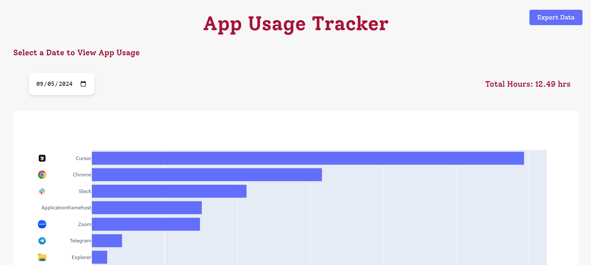

# Desktop_Screen_Time_Tracker
Simple python screen time tracker for windows desktop.

## Components:
### 1. Recorder
Uses win32gui library to record the active window every second

Includes following methods:
- get_active_window_info
- record_active_window
- log

### 2. Summarizer
Reads the records file & does necessary transformation.

Includes following methods:
- get_usage_by_apps
- read_data
- get_unique_days
- get_daily_usage
- usage_at_date
- seconds_to_time

### 3. App
Builds a simple Dash webapp that displays the screen time (for now) daily/monthly/yearly.
Screenshots of the dashboard:
<br>

<p align="center">
  
  
</p>

## To Do:
<div style="margin-left: 2em;">
    <input type="checkbox" disabled checked> Set default value of App Usage Graph to today
    <br>
    <input type="checkbox" disabled checked> Make tracking more efficient:
        <br>
        <div style="margin-left: 4em;">
            <input type="checkbox" disabled checked> Save data in normalized form (saves alot of space instead of repeating apps names for e.g)
            <br>
            <input type="checkbox" disabled checked> Insert records as batches (keep 30s in-memory) to reduce I/O
            <br>
            <input type="checkbox" disabled checked> Use db (sqlalchemy) instead of csv
            <br>
            <input type="checkbox" disabled checked> Summarize old days into hourly app usage data only (each 86,400 rows -> number of apps * 24)
        </div>
    <input type="checkbox" disabled> Improve Dashboard Design
    <br>
    <input type="checkbox" disabled> Add export option to export data to csv or excel
    <br>
    <input type="checkbox" disabled> Add app icons to dashboard
</div>
These are just some ideas to be done soon, surely on the long-run many features could be added. Don't hesitate to share any suggestions!

## Usage
For the ready-to-use application, download the executable setup file from the latest release, [here](https://github.com/homanydata/Desktop_Screen_Time_Tracker/releases/tag/v0.1.0). Run it and follow the instructions within the installer.

To try the code yourself, you can do the following:

1. Clone the repo
    ```
    git clone https://github.com/yourusername/Desktop_Screen_Time_Tracker.git
    ```
2. Install the requirements
    ```
    pip install -r requirements.txt
    ```
3. Create executables

    Run the following commands in the command line (in the project directory)
    ```
    pyinstaller --onefile --noconsole recorder.py
    ```
    ```
    pyinstaller --onefile app.py
    ```
    You will find the exectuables in the dist folder. Make sure to move the recorder.exe and app.exe to the root directory of the repository.

4. Create a shortcut for the recorder.exe

5. Run Recorder on Startup:

    Move the shortcut to the `C:\Users\Admiin\AppData\Roaming\Microsoft\Windows\Start Menu\Programs\Startup\`.
    
    Now the recorder will run on startup and log the screen time to the active_apps_log.csv file.

6. Run the app.exe to view the screen time.

<br><br>
## Get Involved!
If you're interested in contributing to or participating in this project, welcome! 😊

"Desktop_Screen_Time_Tracker" is a simple, fun, and casual project designed to help track your screen time on desktop, just a side project for learning and experimenting!