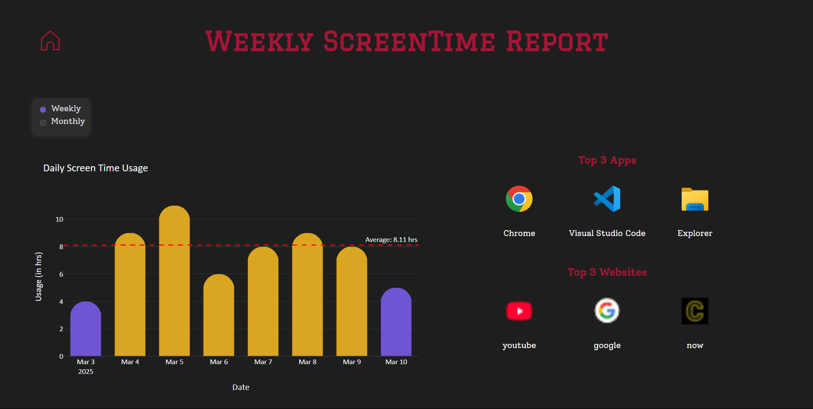

# Desktop_Screen_Time_Tracker
Simple python screen time tracker for windows desktop.

## Components:
### \# Utils:
Provides utilities functionalities for other parts of the application.

**1. DB:** Creates database schema using SQLAlchemy, and provides necessary methods to interact with the database

**2. Summarizer:** Reads the records file & does necessary transformation.

**3. Charts:** Creates plotly figures as json depending on user preferences.

**4. Icon Extractor:** Uses PIL library to extract icons from the active window, if it is a new app.

**5. Logger:** logs errors to local file

### \# Recorder
Uses win32gui library to record the active window every second

### \# Extension
Chrome extension which helps the application to save current active tab in chrome, by sending requests to the browser_recorder.

### \# Browser Recorder
Builds a very basic flask app to recieve requests from the chrome extension and record the active chrome tab every second.

### \# App:
Builds a simple Flask webapp that displays the screen time daily/monthly/yearly, and usage by apps for a selected day.

It consists of 4 blueprints:
- home.py: provides basic routes for the webapp
- browser.py: provides routes for the webapp for browser time tracking
- settings.py: provides routes for changing user preferences
- report.py: provides routes for the weekly/monthly report

Screenshots of the webapp:
<br>

<p align="center">
    
    
    
    
</p>
<br>


## Usage
For the ready-to-use application, download the executable installer from the latest release, [here](https://github.com/Ali-Homany/Desktop_Screen_Time_Tracker/releases/tag/v0.3.0). Run it and follow the instructions within the installer.

In order to re-create the Installer executable from the code yourself, kindly follow the steps below:

1. Clone the repo
    ```
    git clone https://github.com/Ali-Homany/Desktop_Screen_Time_Tracker.git
    ```
2. Create conda environment:

    [Install Anaconda](https://docs.anaconda.com/anaconda/install/) on your machine if you don't have it yet, open its `anaconda prompt` then run
    ```
    conda create --name screen_time_env python
    ```
3. Install dependencies:

    Activate the new environment
    ```
    conda activate screen_time_env
    ```
    Then install the requirements using pip
    ```
    pip install -r requirements.txt
    ```

4. Run [create_application.bat](./deploy/create_application.bat) (make sure to run in the project root directory):

    This will create 3 executables and wrap them into an Installer executable. Done!

<br>

However, if you're more curious or you don't want to run an installer (step 4), you might continue the steps below instead:

4. Create shortcuts for the recorder.exe, browser_recorder.exe and main.exe

5. Run Recorder on Startup:

    Move the 2 recorders shortcuts to the `C:\Users\Admiin\AppData\Roaming\Microsoft\Windows\Start Menu\Programs\Startup\`
    
    Now the recorders will run on startup and log the screen time to the screentime.db file.

6. Run the main.exe to view your screen time dashboard!

<br><br>
## Get Involved!
If you're interested in contributing to or participating in this project, welcome! 😊

"Desktop_Screen_Time_Tracker" is a simple, fun, and casual project designed to help track your screen time on desktop, just a side project for learning and experimenting!