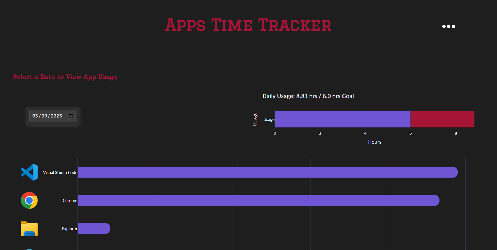
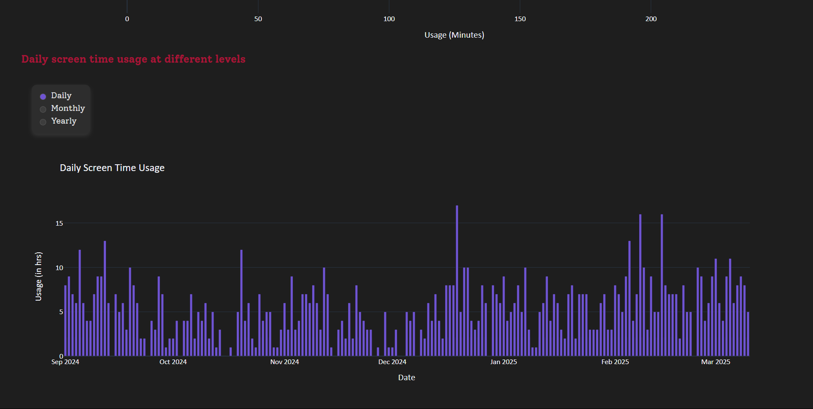

# Desktop_Screen_Time_Tracker
Simple python screen time tracker for windows desktop.

## Components:
### \# Utils:
Provides utilities functionalities for other parts of the application.
#### 1. DB: Creates database schema using SQLAlchemy, and provides necessary methods to interact with the database:
- create_db
- get_all_records
- get_all_apps_names
- get_all_websites_names
- get_last_browser_tab
- add_record
- add_browser_record
- add_app
- add_website
- is_transformation_needed
- transform_new_data

#### 2. Summarizer: Reads the records file & does necessary transformation, includes following methods:
- seconds_to_time
- get_usage_by_apps
- get_denormalized_records
- get_unique_days
- get_daily_usage
- filter_top
- get_usage_by_websites
- get_daily_browser_usage


#### 3. Charts: Creates plotly figures as json depending on user preferences. It includes following methods:
- create_app_usage_figure
- create_total_usage_figure
- aggregate_data
- create_daily_usage_figure

#### 4. Icon Extractor: Uses PIL library to extract icons from the active window, if it is a new app, includes following methods:
- extract_icon
- ico_to_png
- png_to_svg
- extract_website_icon

#### 5. Logger: logs errors to local file

### \# Recorder
Uses win32gui library to record the active window every second

Includes following methods:
- get_active_window_info
- save_app_icon
- record_active_window

### \# Extension
Chrome extension which helps the application to save current active tab in chrome, by sending requests to the browser_recorder.

Includes following files (typical for chrome extensions):
- background.js
- manifest.json
- icon.ico

### \# Browser Recorder
Builds a very basic flask app to recieve requests from the chrome extension and record the active chrome tab every second.

Includes following methods:
- record_active_browser_tab
- extract_domain_name
- save_new_website
- server:
    - /send-url route
    - /check-extension route
- run_server

### \# App:
Builds a simple Flask webapp that displays the screen time daily/monthly/yearly, and usage by apps for a selected day.

It consists of 3 blueprints:
- home.py: provides basic routes for the webapp
- browser.py: provides routes for the webapp for browser time tracking
- settings.py: provides routes for changing user preferences

Screenshots of the webapp:
<br>

<p align="center">
  
  
  
</p>
<br>

## To Do:
- ~~Set default value of App Usage Graph to today~~
- ~~Make tracking more efficient:~~
    - ~~Use db (sqlalchemy) instead of csv~~
    - ~~Save data in normalized form (saves alot of space instead of repeating apps names for e.g)~~
    - ~~Insert records as batches (keep 30s in-memory) to reduce I/O~~
    - ~~Summarize old days into hourly app usage data only (each 86,400 rows -> number of apps * 24)~~
- Improve Dashboard Design
- ~~Add export option to export data to csv or excel~~
- ~~Add app icons to dashboard~~
- ~~Migrate to Flask~~
- ~~Auto-Refresh Dashboard (auto-transform actually)~~
- ~~Add setting page:~~
    - ~~Add dark theme~~
    - ~~Add daily screen time goal (symbolic, doesn't block anything)~~
- ~~Wrap 6th+ apps as 'Others' so app usage graph contains max of 6 apps~~
- Monthly Report (most used apps, avg time, active hours..)
- Add categories pie chart (let user set categories to apps)
- ~~Track Browser Usage:~~
    - ~~Save domains~~
    - ~~Duplicate home page but for browser screen time~~
- Improve how db connections are made (pool or something similar)

These are just some ideas to be done soon, surely on the long-run many features could be added. Don't hesitate to share any suggestions!

<br>

## Usage
For the ready-to-use application, download the executable setup file from the latest release, [here](https://github.com/Ali-Homany/Desktop_Screen_Time_Tracker/releases/tag/v0.3.0). Run it and follow the instructions within the installer.

In order to re-create the Installer executable from the code yourself, kindly follow the steps below:

1. Clone the repo
    ```
    git clone https://github.com/Ali-Homany/Desktop_Screen_Time_Tracker.git
    ```
2. Create conda environment:

    [Install Anaconda](https://docs.anaconda.com/anaconda/install/) on your machine if you don't have it yet, open its `anaconda prompt` then run
    ```
    conda create --name screen_time_env python
    ```
3. Install dependencies:

    Activate the new environment
    ```
    conda activate screen_time_env
    ```
    Then install the requirements using pip
    ```
    pip install -r requirements.txt
    ```
4. Run [create_application.bat](./deploy/create_application.bat):

    This will create 3 executables and wrap them into an Installer executable. Done!

<br>

However, if you're more curious or you don't want to run an installer, you might continue the steps below:

5. Create shortcuts for the recorder.exe, browser_recorder.exe and main.exe

6. Run Recorder on Startup:

    Move the 2 recorders shortcuts to the `C:\Users\Admiin\AppData\Roaming\Microsoft\Windows\Start Menu\Programs\Startup\`
    
    Now the recorders will run on startup and log the screen time to the screentime.db file.

7. Run the main.exe to view your screen time dashboard!

<br><br>
## Get Involved!
If you're interested in contributing to or participating in this project, welcome! 😊

"Desktop_Screen_Time_Tracker" is a simple, fun, and casual project designed to help track your screen time on desktop, just a side project for learning and experimenting!